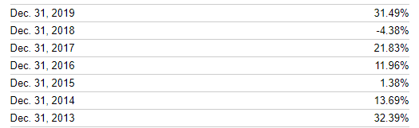

<!-- 
  html_document:
    fig_height: 6
    fig_width: 8
    toc: yes
    toc_depth: 5
editor_options:
  chunk_output_type: console or inline    
    
-->

<!--
pdf formatting:
see https://stackoverflow.com/questions/24657216/caption-above-figure-using-knitr-latex-pdf

---
output: pdf_document
header-includes:
   - \usepackage{floatrow}
   - \floatsetup[figure]{capposition=top}
---


#   ```{r fig.cap="cap, cap, and cap"}
#   plot(1)
#   ```

-->


```{r setup, echo=FALSE, message=FALSE, warning=FALSE, include=FALSE}
knitr::opts_chunk$set(echo = FALSE)
```


```{r notes, include=FALSE}
# It can be hard to get tables to work properly. It seems like it is best to have chunk output inline.

```


```{r libraries, echo=FALSE, message=FALSE, warning=FALSE, include=FALSE}
# source(here::here("includes", "libraries.r"))
library(tidyverse)
# if more than 60 rows, print 60 - enough for states
options(tibble.print_max = 60, tibble.print_min = 60) 
library(readxl)
library(RColorBrewer)

library(maps)
library(usmap)
library(gridExtra)


# library(btools) # Matt, get from my github page if needed
# library(bdata) # Matt, get from my github page if needed
library(ggrepel)
library(DT)
library(knitr)
library(btools)

devtools::session_info()

```


<!-- 
Prepare all of the data, and prepare and save scatterplots in advance, so that conclusions are available for the first section of the document. Other analysis can be done on the fly in later sections.
    
-->

```{r prep_data, rows.print = 11, include=FALSE}
# 0 = No AGI Stub
# 1 = ‘Under $1’
# 2 = '$1 under $10,000'
# 3 = '$10,000 under $25,000'
# 4 = '$25,000 under $50,000'
# 5 = '$50,000 under $75,000'
# 6 = '$75,000 under $100,000'
# 7 = '$100,000 under $200,000'
# 8 = ‘$200,000 under $500,000’
# 9 = ‘$500,000 under $1,000,000’
# 10 = ‘$1,000,000 or more’

# A01000	Net capital gain (less loss) amount

xlfile <- 'Boyd OSC analysis(4).xlsx'

xwalk <- read_excel(here::here('ignore', xlfile),
                    sheet='2018dictionary',
                    skip=2)
xwalk
# ht(xwalk)

stubs <- read_excel(here::here('ignore', xlfile), 
                    sheet='agistubs',
                    range='A3:B14') %>%
              mutate(agi_stub=as.integer(agi_stub))
stubs

ht2 <- readRDS(here::here('data', 'soi', 'ht2.rds'))
glimpse(ht2)

ht2a <- ht2  %>%
  filter(!stabbr %in% c("DC", "PR")) %>%  # PR showed up in 2018
  left_join(stubs,
            by='agi_stub')
count(ht2a, agi_stub, aginame)
glimpse(ht2a)

# A18425 State and local income taxes amount
# n18425

# now make a long file with labels
ht2long <- ht2a %>%
  pivot_longer(cols = -c(year, stabbr, agi_stub, aginame), names_to="varname") %>%
  left_join(xwalk %>% 
              select(varname=variable, description) %>%
              mutate(varname=str_to_lower(varname)),
            by = "varname")

n1 <- ht2long %>%
  filter(varname=="n1") %>% 
  select(year, stabbr, agi_stub, n1=value)

h2n1 <- ht2long %>%
  left_join(n1, by = c("year", "stabbr", "agi_stub")) %>%
  mutate(avgvalue=ifelse(varname %in% c("n1", "mars1", "mars2"), 
                         value / n1 * 100,
                         value / n1 * 1000)) %>%
  group_by(stabbr, agi_stub, varname) %>%
  mutate(pch_value=value / value[match(year - 1, year)] * 100 - 100,
         pch_avg=avgvalue / avgvalue[match(year - 1, year)] * 100 - 100) %>%
  pivot_longer(cols=c(value, avgvalue, pch_value, pch_avg), names_to="measure") %>%
  ungroup
  


# h2n1 %>% filter(stabbr=="CA", agi_stub==0, varname=="mars1")

# examine an extreme outlier -- WI tax liability, stub 1, 2016
check <- h2n1 %>% 
  filter(stabbr=="WI", agi_stub==1, varname=="a10300", measure=="value") %>%
  select(-measure) %>%
  arrange(varname, agi_stub, year)
# DT::datatable(check)
# taxagi %>% filter((stabbr=="WI" & agi_stub==1)) # a10300 for WI in stub 1 in 2016 is an outlier

taxagi <- h2n1 %>%
  filter(varname %in% c("a00100", "a10300"),
         measure=="value") %>%
  select(year, stabbr, agi_stub, aginame, varname, value) %>%
  pivot_wider(names_from=varname) %>%
  mutate(taxpct=a10300 / a00100 * 100)

```


```{r pdata, include=FALSE}

pdata <- taxagi %>%
  filter(year %in% 2016:2018, stabbr!="OA") %>%
  select(year, stabbr, agi_stub, aginame, taxpct) %>%
  pivot_wider(names_from = year, names_prefix="y", values_from = taxpct) %>%
  mutate(change_from2016 = `y2018` - `y2016`,
         change_from2017 = `y2018` - `y2017`)

```


```{r compstates}
# define states of interest
sts <- c("NY", "US", "CT", "MA", "NJ", "CA", "FL", "TX")
compstates <- c("CA","CT", "FL",  "MA", "NJ", "TX")

```


```{r functions}
fstubs <- function(agi_stub){
  factor(agi_stub, levels=stubs$agi_stub, labels=stubs$aginame)
}

```


```{r map_setup, include=FALSE}
#.. Functions
theme_map <- function(base_size=9, base_family="") {
  # see:
  # https://socviz.co/maps.html
  # https://github.com/kjhealy/socviz
  # https://cran.r-project.org/web/packages/usmap/vignettes/mapping.html
  require(grid)
  theme_bw(base_size=base_size, base_family=base_family) %+replace%
    theme(axis.line=element_blank(),
          axis.text=element_blank(),
          axis.ticks=element_blank(),
          axis.title=element_blank(),
          panel.background=element_blank(),
          panel.border=element_blank(),
          panel.grid=element_blank(),
          panel.spacing=unit(0, "lines"),
          plot.background=element_blank(),
          legend.justification = c(0, 0),
          legend.position = c(0, 0)
    )
}


statemap <- function(mapdf, mapvar, 
                     cutpts, cutlabels, map_colors, 
                     map_title, map_subtitle=NULL,
                     legend_title){
  mapdf <- mapdf %>%
    rename(mapvalue=all_of(mapvar)) %>%
    mutate(data_group=cut(mapvalue, cutpts, labels=cutlabels),
           mapvarname=mapvar) %>%
    select(stabbr, mapvarname, mapvalue, data_group)
  
  mdata <- left_join(
    usmap::us_map() %>% 
      arrange(full, piece, order), 
      mapdf %>% rename(abbr=stabbr),
      by="abbr")
  
  p <- mdata %>%
    ggplot(aes(x = x, y = y)) +
    geom_polygon(aes(fill=data_group, group = group),
               color = "gray90", size = 0.1) +
    # na.translate drops NA from the legend
    scale_fill_manual(values=map_colors, drop=TRUE, na.translate=FALSE) + 
    coord_equal() + 
    guides(fill=guide_legend(title=legend_title)) +
    ggtitle(map_title,
            subtitle=map_subtitle) +
    geom_text(data = bdata::statemap_labels %>%
                filter(stabbr != "DC"), aes(x, y, label = stabbr), size = 3) +
    theme_map() +
    theme(legend.position = "right") +
    theme(plot.title = element_text(size = 14, face = "bold"))
  
  #   labs(caption=capt) +
  #   theme(plot.caption = element_text(hjust=0, size=8))
  return(p)
}

```


```{r salt_data, include=FALSE}

# N10300	Number of returns with tax liability	 1040:15
# A10300	Total tax liability amount	 1040:15

# N04450	Number of returns with total standard deduction
# A04450	Total standard deduction amount

# N04470	Number of returns with itemized deductions
# A04470	Total itemized deductions amount

# N18425	Number of returns with State and local income taxes
# A18425	State and local income taxes amount
# N18450	Number of returns with State and local general sales tax
# A18450	State and local general sales tax amount
# N18500	Number of returns with real estate taxes
# A18500	Real estate taxes amount
# N18800	Number of returns with Personal property taxes
# A18800	Personal property taxes amount
# N18460	Number of returns with Limited state and local taxes
# A18460	Limited state and local taxes

h2n1

saltvars <- c('N18425', 'A18425', 'N18450', 'A18450', 'N18500', 'A18500',
              'N18800', 'A18800', 'N18460', 'A18460')

altvars <- c("a00100", "a10300", "n10300", "n04450", "a04450",  "n04470", "a04470")

vars <- c(altvars, str_to_lower(saltvars))

salt_base <- h2n1 %>%
  filter(varname %in% vars, measure=="value") %>%
  select(-measure)
count(salt_base, varname, description)

salt <- salt_base %>%
  select(-description) %>%
  pivot_wider(names_from = varname) %>%
  mutate(dedtotal=naz(a04450) + naz(a04470),
         salt_uncapped=naz(a18425) + naz(a18450) + naz(a18500) + naz(a18800),
         salt_loss=a18460 - salt_uncapped)

salt %>% filter(stabbr=="NY", year==2018)

```


```{r salt_analysis, include=FALSE}
salt_loss <- salt %>%
  # filter(year==2018) %>%
  rename(salt_capped=a18460) %>%
  select(year, stabbr, agi_stub, aginame, n1, a00100, dedtotal, salt_uncapped, salt_capped, salt_loss) %>%
  mutate(across(.cols=c(dedtotal, salt_uncapped, salt_capped, salt_loss), ~ . * 1000 / n1, .names="{.col}_pret"),
         across(.cols=c(dedtotal, salt_uncapped, salt_capped, salt_loss), ~ . / a00100 * 100, .names="{.col}_pctagi"))

salt_loss %>% filter(stabbr=="NY", year==2018)
salt_loss %>% filter(stabbr=="NY", year==2018) %>% select(year, stabbr, agi_stub, aginame, contains("_pctagi"))

# varstub_pch <- function(var, stub, sts, measname="pch_value"){
#   df <- h2n1 %>%
#     filter(varname==var, agi_stub==stub, stabbr %in% sts, !is.na(value),
#            measure==measname) %>%
#     select(year, stabbr, agi_stub, aginame, varname, description,
#            measure, value) %>%
#     pivot_wider(names_from=year) %>%
#     mutate(stabbr=factor(stabbr, levels=sts)) %>%
#     arrange(stabbr)
#   df
# }


```


```{r salt_spinup, include=FALSE}
salt_loss %>%
  select(year, stabbr, agi_stub, aginame, salt_uncapped) %>%
  filter(agi_stub==0, stabbr=="NY") %>%
  ggplot(aes(year, salt_uncapped / 1e6)) +
  geom_line() +
  geom_point() +
  scale_y_continuous(name="$ billions") +
  ggtitle("Uncapped SALT deduction of NY itemizers, $ billions")

salt_loss %>%
  filter(stabbr=="NY") %>%
  mutate(agi_stub=factor(agi_stub, levels=stubs$agi_stub, labels=stubs$aginame)) %>%
  ggplot(aes(year, salt_uncapped_pctagi, colour=agi_stub)) +
  geom_line() +
  geom_point() +
  scale_y_continuous(name="% AGI") +
  ggtitle("Uncapped SALT deduction of NY itemizers, % of AGI")

stlist <- c("US", "NY", compstates)
salt_loss %>%
  select(year, stabbr, agi_stub, aginame, salt_uncapped_pctagi) %>%
  filter(agi_stub==10, stabbr %in% stlist) %>%
  ggplot(aes(year, salt_uncapped_pctagi, colour=stabbr)) +
  geom_line() +
  geom_point()

salt_loss %>%
  filter(stabbr %in% stlist, year==2018) %>%
  ggplot(aes(agi_stub, -salt_loss_pctagi, colour=stabbr)) +
  geom_point()


```


```{r include=FALSE}
# change in salt per return vs change in totded per return
salt %>% filter(stabbr=="NY", year==2018)
df <- salt %>%
  filter(year %in% 2017:2018) %>%
  select(year, stabbr, agi_stub, aginame, n1, a00100, dedtotal, salt_uncapped) %>%
  mutate(across(.cols=c(dedtotal, salt_uncapped), ~ . * 1000 / n1)) %>%
  pivot_longer(cols=c(dedtotal, salt_uncapped)) %>%
  select(year, stabbr, agi_stub, aginame, name, value) %>%
  pivot_wider(names_from = year) %>%
  mutate(change=`2018` - `2017`) %>%
  select(stabbr, agi_stub, aginame, name, change) %>%
  pivot_wider(values_from = change)

df %>%
  mutate(agi_stub=factor(agi_stub, levels=stubs$agi_stub, labels=stubs$aginame)) %>%
  arrange(stabbr, agi_stub) %>%
  ggplot(aes(salt_uncapped, dedtotal)) +
  geom_point() +
  facet_wrap(~agi_stub, ncol = 3, scales = "free")

```


```{r}
# salt loss and change in etr

```


```{r scatterplot2, fig.height=7, fig.width=7, dpi=500, include=FALSE}
# scatterplot of change in average tax rate
# taxagi
# taxagi %>% filter((stabbr=="WI" & agi_stub==1)) # a10300 for WI in stub 1 in 2016 is an outlier

f2 <- function(baseyear){
  basevar <- paste0("y", baseyear)
  pdata2 <- pdata %>%
    filter(!(stabbr=="WI" & agi_stub==1), # outlier
           stabbr != "DC") %>%
    group_by(agi_stub) %>%
    mutate(agi_stub2=factor(agi_stub, levels=stubs$agi_stub, labels=stubs$aginame),
           base=get(basevar),
           change=y2018 - base,
           abschange=abs(change),
           rchange=row_number(desc(abschange))) %>%
    ungroup %>%
    arrange(agi_stub, stabbr)
  # pdata2
  
   p1 <- pdata2 %>%
     filter(agi_stub==0) %>%
     mutate(grp=case_when(stabbr=="NY" ~ 1,
                         stabbr == "US" ~ 2,
                         stabbr %in% compstates ~ 3,
                         rchange <= 6 ~ 4, # outliers
                         y2017 < 12 ~ 4,
                        TRUE ~ 5),
           grp=factor(grp)) %>%
     arrange(grp) %>%
    ggplot(aes(base, y2018, colour=grp, label=stabbr)) +
      scale_colour_manual(values=c("blue", "red", "forestgreen", "salmon1", NA)) +
      geom_text(size=2.25, nudge_y=0.15) +
      geom_point(colour="darkgrey", size=0.75) +
      scale_x_continuous(name=paste0("Average tax rate in ", baseyear, " (%)"),
                         limits=c(10.2, 18.2), breaks=8:20) +
      scale_y_continuous(name="Average tax rate in 2018 (%)", limits=c(10.2, 18.2), breaks=8:20) +
      geom_abline(slope=1, intercept=0, size=0.4, colour="red") +
      theme_bw() +
      theme(legend.position = "none") +
      labs(caption="Caution: Adjusted gross income definition has changed across years") +
      theme(plot.caption = element_text(hjust=0, size=rel(.8))) +
      ggtitle(paste0("Average tax rates as % of adjusted gross income in ", baseyear, " and 2018"),
              subtitle = paste0("Vertical distance from diagonal line measures change in tax rate"))
  p1 + coord_equal()
}

# f2(2017)

psave2 <- function(baseyear){
  p <- f2(baseyear)
  fname <- paste0("avgtax2018v2_vs", baseyear, ".png")
  ggsave(here::here("images", fname), plot=p, width=7, height=7, units="in", scale=1.5, dpi=500)
  # return(NULL)
}
# psave2(2017)

```


```{r facetplot, fig.height=7, fig.width=7, dpi=500, include=FALSE}
# scatterplot of change in average tax rate
# taxagi
# taxagi %>% filter((stabbr=="WI" & agi_stub==1)) # a10300 for WI in stub 1 in 2016 is an outlier


f <- function(baseyear){
  basevar <- paste0("y", baseyear)
  
  stubs2plus <- stubs %>% filter(agi_stub >= 2)
  
  pdata2 <- pdata %>%
    filter(agi_stub > 1) %>%
    filter(!(stabbr=="WI" & agi_stub==1), # outlier
           stabbr != "DC") %>%
    group_by(agi_stub) %>%
    mutate(base=get(basevar),
           change=y2018 - base,
           abschange=abs(change),
           rchange=row_number(desc(abschange))) %>%
    ungroup %>%
    mutate(agi_stub=factor(agi_stub, levels=stubs2plus$agi_stub, labels=stubs2plus$aginame)) %>%
    arrange(agi_stub, stabbr)
  
  facetlims <- pdata2 %>% 
    group_by(agi_stub) %>% 
    summarise(min = min(base, y2018), max = max(base, y2018), .groups="drop") %>%
    pivot_longer(cols=-agi_stub) %>%
    mutate(stabbr=NA_character_, grp=as.factor(1)) %>%
    select(agi_stub, stabbr, grp, base=value, y2018=value)
  # glimpse(pdata2)
  

  p <- pdata2 %>%
         mutate(grp=case_when(stabbr=="NY" ~ 1,
                         stabbr == "US" ~ 2,
                         stabbr %in% compstates ~ 3,
                         rchange <= 6 ~ 4, # outliers
                         # y2017 < 12 ~ 4,
                        TRUE ~ 5),
           grp=factor(grp)) %>%
    arrange(agi_stub) %>%
    ggplot(aes(base, y2018, colour=grp, label=stabbr)) +
      scale_colour_manual(values=c("blue", "red", "forestgreen", "salmon1", NA)) +
      geom_text(size=2.25, nudge_y=0.15) +
      geom_point(colour="darkgrey", size=0.25) +
      scale_x_continuous(name=paste0("Average tax rate in ", baseyear, " (%)")) +
      scale_y_continuous(name="Average tax rate in 2018 (%)") +
      geom_blank(data = facetlims) +
      geom_abline(slope=1, intercept=0, size=0.4, colour="red") +
      theme_bw() +
      theme(legend.position = "none") +
      labs(caption="Caution: Adjusted gross income definition has changed across years") +
      theme(plot.caption = element_text(hjust=0, size=rel(.8))) +
      ggtitle(paste0("Average tax rates as % of adjusted gross income in ", baseyear, " and 2018"),
              subtitle = paste0("Vertical distance from diagonal line measures change in average tax rate")) +
     facet_wrap(vars(agi_stub), ncol=3, scales="free")
  p
}

psave <- function(baseyear){
  p <- f(baseyear)
  fname <- paste0("avgtax2018_vs", baseyear, ".png")
  ggsave(here::here("images", fname), plot=p, width=7, height=7, units="in", scale=1.5, dpi=500)
  # return(NULL)
}
# psave(2016)
# psave(2017)

```


```{r echo=FALSE, fig.height=9, fig.width=9, out.height='100%', out.width='100%', include=FALSE}

data <- taxagi %>%
  filter(year %in% 2017:2018, stabbr %in% c("US", state.abb)) %>%
  select(year, stabbr, agi_stub, aginame, taxpct) %>%
  pivot_wider(names_from = year, values_from=taxpct) %>%
  mutate(change=`2018` - `2017`,
         agi_stub=factor(agi_stub, 
                         levels=stubs$agi_stub, 
                         labels=str_wrap(stubs$aginame, 10))) %>%
  # now create a stub-specific grouping variable
  group_by(agi_stub) %>%
  # low rank is most-negative change 1:51
  mutate(rank=row_number(change),
         grp=case_when(stabbr=="NY" ~ 1,
                         stabbr == "US" ~ 2,
                         stabbr %in% compstates ~ 3,
                         rank %in% c(1, 2, 50, 51) ~ 4,
                         TRUE ~ 5),
         grp=as.factor(grp)) %>%
  arrange(agi_stub, grp)
# data
# levels(data$grp)
# as.integer(levels(data$agi_stub))
# as.integer(data$agi_stub)

shift <- 0.15
textpos <- data %>%
  filter(grp %in% c("1", "2", "3", "4")) %>%
  group_by(agi_stub) %>%
  mutate(nudge=case_when(stabbr %in% c("US", "NY") ~ shift,
                         change==max(change) ~ shift,
                         change==min(change) ~ -shift,
                         TRUE ~ 0.05),
         nudge=ifelse(stabbr=="NY" & as.integer(agi_stub) %in% c(2, 6), nudge + shift, nudge),
         x=as.integer(agi_stub) + nudge,
         y=change) %>%
  ungroup

p_etrchange <- data %>%
  # filter(as.integer(agi_stub) != 1) %>%
  ggplot(aes(agi_stub, change)) +
  geom_point(colour="darkgrey", size=0.75) +
      geom_text(aes(x=x, y=y, colour=grp, label=stabbr),
            size=2.25,
            fontface = "bold",
            # nudge_x = 0.1,
            data=textpos) +
  scale_colour_manual(values=c("blue", "red", "forestgreen", "forestgreen", NA)) +
  geom_hline(yintercept = 0) +
  scale_y_continuous("change, % of adjusted gross income", breaks=seq(-10, 10, .5)) +
  scale_x_discrete(name=NULL) +
  ggtitle("Change from 2017 to 2018 in federal income tax liablity as % of adjusted gross income",
          subtitle="The lower the value, the greater the reduction in tax. Values above 0 are increases.") +
  theme_bw() +
  theme(legend.position = "none") # +
  # labs(caption="Caution: Adjusted gross income definition has changed across years") +
  # theme(plot.caption = element_text(hjust=0, size=rel(.8)))
p_etrchange

ggsave(here::here("images", "etrchange.png"), plot=p_etrchange, width=7, height=7, units="in", scale=1.5, dpi=500)

```


**Use the links above to navigate this document (Ctrl-home to return to the top to access the links).**


# What's done and what's to come

I have been assuming you are particularly interested in the following:

1.  How have taxes on New Yorkers changed between 2017 and 2018, in comparison to the rest of the nation? To what extent might that result from the TCJA?

2.  How high are taxes on New Yorkers in comparison to the rest of the nation?

3.  How have SALT deductions changed and how has that affected taxes?

4.  To what extent did taxpayers shift income and deductions in anticipation of and as a result of the TCJA?

5.  Miscellaneous descriptive questions such as changes in numbers of returns and change in New Yorkers' federal income tax liability as a share of total U.S. federal income tax liability.

Some of these questions can be answered reasonably well with the new IRS Historical Table 2 data for 2018 and some cannot. Some can be answered much better or more confidently with microdata, if we go forward with the second part of this project, than with the aggregated Historical Table 2 data.


Here's how I think the analysis below measures up against these questions.

1. Changes in taxes: The analysis focuses on how effective tax rates have changed between 2017 and 2018. I think it does a pretty good job within the limits of the aggregated data.

2. How high are taxes on New Yorkers?: I didn't address this directly but you'll find scatterplots in the *Details* section that show where NY fits, by income range. (The scatterplots with the diagonal lines.)

3. SALT deductions: I have a placeholder for this. I've done a lot of looking but haven't put anything in the document yet.

4. Income and deduction shifting: Also a placeholder. I've done some looking and been surprised that it isn't as obvious as I expected, although I am sure it did happen.

5. Miscellaneous descriptive analysis: I did a lot of this as I was wandering through data in the beginning, and it is not well organized. Most of it is in the *Descriptive analysis* section. Among other things the section provides descriptive data on:
    + Changes in total tax liability
    + Each state's tax liability as a % of the national total
    + Changes in numbers of returns.


# CAUTIONS

The main caution is that much of the analysis below relies on comparing a measure of effective tax rates that is cruder than we would like. That measure is federal income tax liability as a percentage of adjusted gross income. I examine changes in this measure over time, and differences across states and income ranges.

It is not a perfect apples-to-apples comparison for several reasons:

* There are many reasons for changes from one year to the next - people may have shifted income between years of have had economic changes that affected the measures. It is not the same as calculating 2017 tax law and 2018 tax law on the same exact data, which we can do in the second part of this project should we go forward.

* The definition of AGI may have had some changes across years although I do not think that will have a big impact on results.

* AGI is an imperfect measure of income or economic resources, but it's the only one we have available to us here.


# Conclusions

## How effective tax rates changed between 2017 and 2018

Key conclusions:

* New Yorkers in all adjusted gross income ranges below $1 million paid lower taxes as a percentage of AGI in 2018 than in 2017. (I call this the effective tax rate as shorthand, but see details below.)
* Millionaires in NY, CA, and CT paid higher effective tax rates than in 2017.
* Although non-millionaire New Yorkers received tax cuts, their tax reductions were much smaller than in other states.
* Many other high-tax states had similar changes.


### Scatterplot of changes in effective tax rates between 2017 and 2018, by income range

The figure below illustrates the points above:

* The vertical axis shows the change in effective tax rate between 2017 and 2018. That is, it shows the effective rate in 2018 minus the effective rate in 2017, where the effective rate in each year is the federal tax liability in that year as a percent of adjusted gross income.
* The horizontal axis shows different income ranges. The first group on the left, "All income ranges," shows the average over all tax returns. The next group, "Under $1" shows the results for returns with zero or negative AGI. (Many taxpayers in this range are highly atypical and I wouldn't pay much attention to it.) As you move to the right, we have higher income ranges, ending with millionaires on the far right.
* Each gray point represents a state. I have labeled several states in each income range: NY (blue), US average (red), and selected other states (green). The other states always include CA, CT, FL, MA, NJ, and TX, and in addition I have included the two highest and lowest states in each group.
* The horizontal line is at zero - states above the line had an increase in the average effective tax rate; as you can see, millionaires in CA and CT, as well as in NY, had an increase.
* Here's an example of how to interpret it: In 2017, in the $500k - $1 million income range, federal income tax paid by New Yorkers was 26.54% of their AGI and in 2018, the effective rate was 25.39%, a reduction of 1.15 percentage points. The negative 1.15% points is the dot shown on the graph, which makes NY the highest state in this group -- i.e., it had the smallest reduction in effective tax rate of all states.
* As you can see, NY is at or near the top for most ranges, meaning that tax reductions were smaller in NY than elsewhere (and millionaires had increases).

Some of the states are difficult to make out. While it is possible to improve the figure, it is probably better to just look at a table. In the details section I've provided tables with data underlying the figure.


```{r echo=FALSE, fig.height=9, fig.width=9, out.height='100%', out.width='100%', include=TRUE}
p_etrchange
```

### Maps of changes in effective tax rates

```{r color_check, eval=FALSE, include=FALSE}
display.brewer.all()
# display.brewer.pal(n, name)
# brewer.pal(n, name) # 2. Return the hexadecimal color code of the palette

display.brewer.pal(n = 8, name = 'Dark2')
display.brewer.pal(n = 3, name = 'Blues')
display.brewer.pal(n = 3, name = 'Reds')
brewer.pal(n = 8, name = 'Dark2')
# scale_fill_brewer() for box plot, bar plot, violin plot, dot plot, etc
# scale_color_brewer() for lines and points
brewer.pal(n = 3, name = 'Blues')[2:3]
display.brewer.pal(n = 3, name = 'Blues')

```


```{r mapdata, include=FALSE}
df <- taxagi %>%
  filter(year %in% 2017:2018, stabbr %in% c("US", state.abb)) %>%
  select(year, stabbr, agi_stub, aginame, taxpct) %>%
  pivot_wider(names_from = year, values_from=taxpct) %>%
  mutate(change=`2018` - `2017`)

count(df, agi_stub, aginame)

```

#### Map of changes for all taxpayers

The figure below maps the change in effective federal tax rate for all taxpayers. The states with the largest decline are deepest red and those with the smallest decline are deepest blue. As expected, states with lower state and local taxes (e.g., Florida) have the largest federal tax reductions.

```{r mapstub0, echo=FALSE}
dfsub <- df %>% filter(agi_stub==0)
# dfsub %>% arrange(change)

# define cuts 
# quantile(dfsub$change)
cutpoints <- c(-Inf, -1.75, -1.5, -1.25, -1, Inf)
cutlabs <- c("< -1.75%", 
             "-1.75% to < -1.50%", 
             "-1.50% to < -1.25%", 
             "-1.25% to < -1.00%",
             "-1.00% or higher")
cutvals <- cut(dfsub$change, cutpoints, right=FALSE)
# table(cutvals) %>% as.data.frame()

# cbind(cutlabs, table(cutvals) %>% as.data.frame())

blue2 <- brewer.pal(n = 3, name = 'Blues')[2:3]
red2 <- brewer.pal(n = 3, name = 'Reds')[2:3]
clrs <- c(red2 %>% rev, "lightgrey", blue2)

p <- statemap(dfsub, mapvar="change", 
         cutpts=cutpoints, cutlabels=cutlabs,
         map_colors=clrs, 
         map_title="Change in federal effective tax rate from 2017 to 2018, all taxpayers",
         map_subtitle="Effective tax rate defined as federal tax liability as % of adjusted gross income",
         legend_title="Change in effective rate")
p

# ggsave(here::here("results", "rqtax_v_2010_map.png"), plot=p, width=16, height=9, scale=.7)

```

#### Map of changes for taxpayers in the $100-200k AGI range

The next map shows the change for taxpayers with adjusted gross incomes in the $100k to $200k range. Caution: I have used different cutpoints in this map than in the first to keep the number of states in each group reasonably distributed.

```{r mapstub7, echo=FALSE}
dfsub <- df %>% filter(agi_stub==7)
# dfsub %>% arrange(change)

# define cuts 
# quantile(dfsub$change)
cutpoints <- c(-Inf, -2.00, -1.75, -1.5, -1.25, Inf)
cutlabs <- c("< -2.00%", 
             "-2.00% to < -1.75%", 
             "-1.75% to < -1.50%", 
             "-1.50% to < -1.25%", 
             "-1.25% or higher")

# cutpoints <- c(-Inf, -1.75, -1.5, -1.25, -1, Inf)
# cutlabs <- c("< -1.75%", 
#              "-1.75% to < -1.50%", 
#              "-1.50% to < -1.25%", 
#              "-1.25% to < -1.00%",
#              "-1.00% or higher")

cutvals <- cut(dfsub$change, cutpoints, right=FALSE)
# table(cutvals) %>% as.data.frame()
# cbind(cutlabs, table(cutvals) %>% as.data.frame())

blue2 <- brewer.pal(n = 3, name = 'Blues')[2:3]
red2 <- brewer.pal(n = 3, name = 'Reds')[2:3]
clrs <- c(red2 %>% rev, "lightgrey", blue2)

p <- statemap(dfsub, mapvar="change", 
         cutpts=cutpoints, cutlabels=cutlabs,
         map_colors=clrs, 
         map_title="Change in federal effective tax rate from 2017 to 2018, $100-200k income range",
         map_subtitle="Effective tax rate defined as federal tax liability as % of adjusted gross income",
         legend_title="Change in effective rate")
p

# ggsave(here::here("results", "rqtax_v_2010_map.png"), plot=p, width=16, height=9, scale=.7)

```


## Change in federal income tax liability, NY vs. other states
```{r taxliab, include=FALSE}
taxliab <- taxagi %>%
  filter(year >= 2016) %>%
  select(year, stabbr, agi_stub, aginame, a10300) %>%
  mutate(year=paste0("TY", year),
         a10300=a10300 / 1e3) %>%
  pivot_wider(values_from = a10300, names_from=year) %>%
  mutate(d2017_2016=TY2017 - TY2016,
         d2018_2017=TY2018 - TY2017,
         pd2017_2016 = d2017_2016 / TY2016 * 100,
         pd2018_2017 = d2018_2017 / TY2017 * 100)
#  taxliab
# taxliab %>% filter(agi_stub==10) %>% arrange(-pd2018_2017)

```


### Table of dollar and percent changes in federal income tax liability

Income tax liability of New Yorkers declined $2.7 billion (-1.8%) in 2018 after rising $17 billion in 2017. The table below gives the liability amounts, in $ millions, in 3 tax years, as well as the dollar changes and % changes. It is filterable and sortable, if you want to look at subsets.


```{r tab_taxliab}

tab <- taxliab %>% 
  datatable(colnames = c('2017 minus 2016'='d2017_2016',
                         '2018 minus 2017'='d2018_2017',
                         '% change 2016 to 2017'='pd2017_2016',
                         '% change 2017 to 2018'='pd2018_2017'),
            filter='top',
            options=list(pageLength = 11),
            caption = htmltools::tags$caption(style = 'caption-side: top; text-align: left;',
                                                'Federal income tax liability in $ millions,
                                                2016-2018'))
tab %>% formatRound(columns=4:10, digits=1)
```


### Table of each state's federal income tax liability as a percent of the U.S. total

Federal income tax liability of New Yorkers as a share of income tax liability for the U.S. as a whole increased slightly between 2017 and 2018, from 8.9% to 9.0%. This was true across most income ranges, although not for the $1 million+ range. 

I don't find this measure particularly useful because so many things can affect it and it is hard to disentangle them.

There appears to have been rapid growth in this income group in many other states, but I haven't finished investigating this.

The table below illustrates this. It has the same filtering and sorting capabilities as the table above.


```{r tab_taxliab_share}

tab <- taxliab %>% 
  select(stabbr, agi_stub, aginame, starts_with("TY")) %>%
  group_by(agi_stub) %>%
  mutate(across(.cols=c(TY2016, TY2017, TY2018),
                ~ . / .[stabbr=="US"] * 100,
                .names="{.col}_pct")) %>%
  datatable(filter='top',
            options=list(pageLength = 11),
            caption = htmltools::tags$caption(style = 'caption-side: top; text-align: left;',
                                                'Federal income tax liability in $ millions,
                                                and as a percent of the U.S. total,
                                                2016-2018'))
tab %>% formatRound(columns=4:9, digits=1)
```


## The SALT deduction [TO COME]


## Shifting of income and deductions [TO COME]


# Descriptive analysis

## Average tax rates

### Change in average tax rates from 2017 to 2018

The figure below shows effective tax rates. Each panel shows total federal income tax as a percentage of adjusted gross income in 2017 and 2018 in each income range the IRS reports. The horizontal axis shows 2017 rates and the vertical axis shows 2018 rates.

In essence this is an effective tax rate, although we have to be a little cautious in treating it as precisely comparable across years because the definition of AGI changed between 2017 and 2018 and I need to investigate the extent to which the denominator changed. We would prefer to have the same definition in each year but we are limited by the data we have.

States above the diagonal line had a higher effective tax rate in 2018 than in 2017, while states below the line had a lower effective tax rate. States are labeled, with New York in blue and the national average in red. We can't identify all states in all panels. If that becomes important to you, I can show each panel separately and larger. I'll add some tables in a later iteration, also, which will allow separate identification of states.

Using language a little loosely, we can see that in all but the $1 million and higher income range, New Yorkers had a tax cut (lower effective tax rate). We can also see that for incomes of $100k and higher, the tax reduction for New Yorkers was less than for most other states and often it is near other New England or northeastern states (i.e., other high-tax states).

We have to be a little cautious about interpretation. Many factors affect the tax rate within an income range, most of which we can't get at with these data:

* Within each income range, New York is to the right - it has a higher effective rate than most other states in the same income range. New Yorkers may be more concentrated in the higher-income portion of each income range and thus subject to higher marginal rates.
* Single filers account for 52% of filers in NY and 48% nationally (including NY), and generally face higher effective rates for a given level of income than do married filers.
* NY has 1.8 exemptions per return versus 1.92 nationally, which would lead to higher taxable income for a given amount of AGI, all else equal.
* On the other hand, NY has higher deductions as a percentage of AGI (15.9%) compared to the nation (12.8%), which would lead to lower taxable income for a given amount of AGI, all else equal.

We would need microdata such as those we will use in the second part of this project (assuming you would like to go forward with it) to get at that issue.

In addition, both years are unusual in some way. The comparison year of 2017 is unusual because there were incentives to push income out of that year and into 2018 when rates were lower, and to accelerate deductions into 2017 when rates were higher, and of course there were incentives to push SALT deductions into 2017. I address this, partially, by putting a similar figure later in this document that compares 2018 to 2016. The general patterns are quite similar so I use 2017 here to reduce risk of confusion. Again, the best way to address this is with microdata.


### Scatterplot: Average tax rates in 2017 and 2018, all taxpayers
```{r echo=FALSE, fig.height=9, fig.width=9, out.height='100%', out.width='100%', include=TRUE}
f2(2017)
```

### Scatterplot: Average tax rates in 2017 and 2018, by income range
```{r echo=FALSE, fig.height=9, fig.width=9, out.height='100%', out.width='100%', include=TRUE}
f(2017)
```

### Table: Average tax rates in 2016, 2017, and 2018, all states and income ranges
```{r etr_table}
tab <- pdata %>% 
  datatable(colnames = c('2016'='y2016',
                         '2017'='y2017',
                         '2018'='y2018',
                         '2018 minus 2016'='change_from2016',
                         '2018 minus 2017'='change_from2017'),
            filter='top',
            options=list(pageLength = 11),
            caption = htmltools::tags$caption(style = 'caption-side: top; text-align: left;',
                                                'Federal income tax liability as % of Adjusted Gross Income,
                                                2016-2018'))
tab %>% formatRound(columns=4:8, digits=1)
```


### Selected additional tables, tax as % of AGI
```{r}

taxagi %>%
  filter(stabbr =="NY") %>%
  arrange(stabbr) %>%
  select(year, stabbr, agi_stub, aginame, taxpct) %>%
  pivot_wider(names_from=year, values_from=taxpct) %>%
  kable(digits=1, caption = "Tax liability as % of adjusted gross income")

taxagi %>%
  filter(stabbr %in% sts, agi_stub==0) %>%
  mutate(stabbr=factor(stabbr, levels=sts)) %>%
  arrange(stabbr) %>%
  select(year, stabbr, agi_stub, aginame, taxpct) %>%
  pivot_wider(names_from=year, values_from=taxpct) %>%
  kable(digits=1, caption = "Tax liability as % of adjusted gross income")

taxagi %>%
  filter(stabbr %in% sts, agi_stub==9) %>%
  mutate(stabbr=factor(stabbr, levels=sts)) %>%
  arrange(stabbr) %>%
  select(year, stabbr, agi_stub, aginame, taxpct) %>%
  pivot_wider(names_from=year, values_from=taxpct) %>%
  kable(digits=1, caption = "Tax liability as % of adjusted gross income")


```


## Number of tax returns
```{r tab_functions}
var <- "n1"
stub <- 0
st <- "US"
varstub_pch <- function(var, stub, sts, measname="pch_value"){
  df <- h2n1 %>%
    filter(varname==var, agi_stub==stub, stabbr %in% sts, !is.na(value),
           measure==measname) %>%
    select(year, stabbr, agi_stub, aginame, varname, description,
           measure, value) %>%
    pivot_wider(names_from=year) %>%
    mutate(stabbr=factor(stabbr, levels=sts)) %>%
    arrange(stabbr)
  df
}

varstate_pch <- function(var, st, measname="pch_value"){
  df <- h2n1 %>%
    select(year, stabbr, agi_stub, aginame, varname, 
           description, measure, value) %>%
    filter(varname==var, stabbr==st, !is.na(value),
           measure==measname) %>%
    pivot_wider(names_from=year) %>%
    mutate(stabbr=factor(stabbr, levels=sts)) %>%
    arrange(stabbr)
  df
}

# varstub_pch("n1", 0, sts) %>% kable(digits=1)

```


### % change in number of returns: all returns and selected income groups

#### New York, all income ranges
The first table below shows the % change in # of tax returns in NY by income range. We normally would expect returns to grow at somewhere near the rate of population or employment growth -- say 0.5% to 1% on average over the long run. The total number of returns grew 0.5% in 2018, with declines in lower income groups and increases in upper income groups. This general pattern is not surprising although some specific numbers may be.


```{r}
varstate_pch("n1", "NY") %>% kable(digits=1, caption="Percent change in number of returns")

```

One reason the number in lower income groups declines while the number in upper income groups increases is that inflation and productivity growth tends to drive people into higher income brackets over time (unless we adjust brackets so that they are different each year, reflecting inflation). 

A second major factor that affects year-to-year growth is the economy, and particularly capital gains. In stock market boom years people may find their taxable income boosted as a result of capital gains, driving them into higher brackets. This is most relevant to upper-income brackets. The table below, copied from [here](https://ycharts.com/indicators/sp_500_total_return_annual) shows total (including dividends) % returns in the S&P 500 on a year-end over year-end basis. Stock market increases tend to be correlated with capital gains, so this likely drove the number of high-income taxpayers up in quite a few of the years in question, including 2016 and 2017. This correlation is not tight and lags and other issues come into play, so I would not over-interpret it. 



To test this, we look at capital gains income. The table below shows growth in total capital gains income (not average capital gains). It sure looks like the rapid growth in 2017 had a lot to do with the rapid growth in the number of returns in the highest brackets in 2017, and the general movement through the brackets, more than offsetting the impact of the incentive to defer income out of 2017. (Two notes: (1) this is capital gains reported on federal returns so it no doubt differs some from gains reported on NY returns as reported by the Budget Division, and (2) while the growth rates in the lower income brackets are substantial, they don't have much capital gains so it may not have had a big impact on their overall AGI.)


### Capital gains growth in NY
```{r}

varstate_pch("a01000", "NY") %>% kable(digits=1, caption="Percent change in net capital gains")

```


A third major factor that affects year to year growth is behavioral shifts in response to actual tax changes and anticipated tax changes. We know there was an incentive to decelerate income out of 2017 into 2018 to take advantage of the lower tax rates enacted for 2018 in the TCJA. It's not obvious from the %-change table above that this happened, but we'll return to this.


#### The United States, all income ranges
The next table shows the same thing for the United States as a whole. The same general pattern of slow growth or decline in the lower income ranges and rapid growth in the upper income ranges holds, for the same reasons.

```{r}
varstate_pch("n1", "US") %>% kable(digits=1, caption="Percent change in number of returns")
# varstate_pch("n1", "CA") %>% kable(digits=1)
# varstate_pch("n1", "CT") %>% kable(digits=1)
# varstate_pch("n1", "FL") %>% kable(digits=1)
# varstate_pch("n1", "TX") %>% kable(digits=1)

```


### % change in number of returns: New York and selected other states, selected income groups
In many of the tables that follow, I compare NY to the US, and to CA, CT, FL, MA, NJ, and TX. I chose these states, because they are large, or neighbors, or often considered comparison states for NY, or some combination of these reasons. FL and TX, of course, have no income tax and FL has a very low overall state-local tax burden.

The first table below shows % change in number of returns overall, just to position our heads. There's quite a bit of variation from year to year and I don't understand all of it. FL and TX have pretty big increases in 2017, which we explore further below.

```{r}
varstub_pch("n1", 0, sts) %>% kable(digits=1, caption="Percent change in number of returns")

```

The next 3 tables show the top 3 income ranges.

```{r}
# varstub_pch("n1", 7, sts) %>% kable(digits=1)
varstub_pch("n1", 8, sts) %>% kable(digits=1, caption="Percent change in number of returns")
varstub_pch("n1", 9, sts) %>% kable(digits=1, caption="Percent change in number of returns")
varstub_pch("n1", 10, sts) %>% kable(digits=1, caption="Percent change in number of returns")
```

Given the extraordinary growth in FL and TX in 2017 in the number of returns in the upper income range, let's look at capital gains in all states in that income range. As you can see, they experienced phenomenal growth in capital gains. These data can't tell us whether the increase in the number of FL millionaire returns was due to out-of-state millionaires moving into FL, or non-millionaire Floridians moving into the FL millionaire bracket due to increased income from realization of capital gains and other factors. The lack of state income taxes in FL and TX makes it relatively more attractive for residents of those states to realize capital gains than it is for residents of high-tax states. On the other hand, IRS migration data (not shown here) show that FL does have a steady annual inflow of high-income taxpayers from other places, and NY has a steady outflow. In my opinion based on reviews of research and other data, the 2017 increase likely was predominantly attributable to people being pushed into higher federal tax brackets although there probably was some of both effects.

```{r}
varstub_pch("a01000", 10, sts) %>% kable(digits=1, caption = "Percent change in capital gains")

```


## Tax liability

### Percent change in total tax liability
```{r}
varstate_pch("a10300", "NY") %>% kable(digits=1, caption="Percent change in tax liability")
varstate_pch("a10300", "US") %>% kable(digits=1, caption="Percent change in tax liability")

```

### Average tax liability amount (dollars)
```{r}
varstate_pch("a10300", "NY", measname = "avgvalue") %>%
  kable(digits=0, caption = "Average tax liability", format.args=list(big.mark=","))
varstate_pch("a10300", "NY", measname = "avgvalue") %>%
  kable(digits=0, caption = "Average tax liability", format.args=list(big.mark=","))
```


### Top income ranges
```{r}
varstub_pch("a10300", 10, sts) %>% kable(digits=1, caption = "Percent change in tax liability")
```

```{r}
varstub_pch("a10300", 10, sts, measname = "avgvalue") %>%
  kable(digits=0, caption = "Average tax liability", format.args=list(big.mark=","))
```


```{r eval=FALSE}
# A10300	Total tax liability amount [11]
# get n, value, and averages for selected variables
vars <- c("")

ht2 %>%
  filter(year %in% 2016:2018,
         agi_stub == 0,
         !stabbr %in% c("OA", "PR")) %>%
  select(year, stabbr, agi_stub, a10300) %>%
  mutate(year=paste0("y", year)) %>%
  pivot_wider(names_from = year, values_from=a10300) %>%
  mutate(p1617=y2017 / y2016 * 100 - 100,
         p1718 =y2018 / y2017 * 100 - 100) %>%
  arrange(p1718) %>%
  kable(format='rst', digits=c(rep(0, 5), 1, 1))
  

```


```{r millionaires, rows.print=11, eval=FALSE}

mdf <- ht2_all %>%
  filter(year==2017) %>%
  group_by(stabbr) %>%
  mutate(mpct = n1 / n1[agi_stub == 0] * 100) %>%
  ungroup %>%
  filter(agi_stub==10) %>%
  mutate(avgagi_m=a00100 / n1 / 1e3,
         marpct=mars2 / n1 * 100,
         avgkids=numdep / n1,
         oldpct = elderly / n1 * 100,
         wagepct = a00200 / a00100 * 100,
         cgpct = a01000 / a00100 * 100,
         businc = a00900,
         partinc = a26270,
         busincpct=businc / a00100 * 100,
         partincpct=partinc / a00100 * 100,
         retinc=a01400 + a01700 + a02500,
         retincpct=retinc / a00100 * 100,
         otherpct=100 - wagepct - cgpct - busincpct - partincpct - retincpct) %>%
  select(stabbr, n1, mpct, avgagi_m, marpct, avgkids, oldpct, wagepct, cgpct, busincpct, partincpct, retincpct, otherpct)

mdf %>%
  filter(!stabbr %in% c("OA", "DC")) %>%
  mutate(rank=rank(-mpct)) %>%
  mutate(across(c(avgkids, contains("pct"), -mpct), function(x) round(x, 1))) %>%
  mutate(across(avgagi_m, function(x) round(x, 2))) %>%
  mutate(across(mpct, function(x) round(x, 2))) %>%
  arrange(rank) %>%
  filter(row_number() %in% 1:10 | stabbr=="US") %>%
  select(stabbr, n1, mpct, rank, everything()) %>%
  datatable(options = list(pageLength = 11))
  


```

